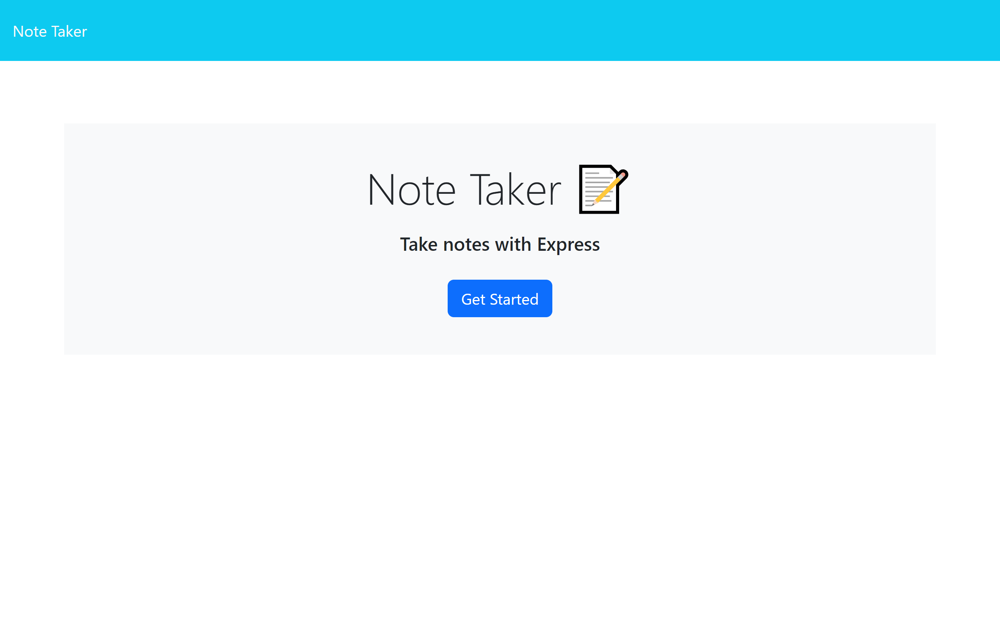
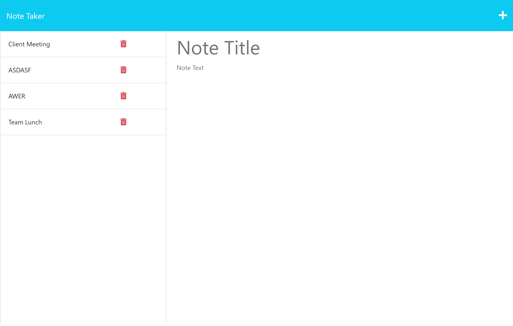
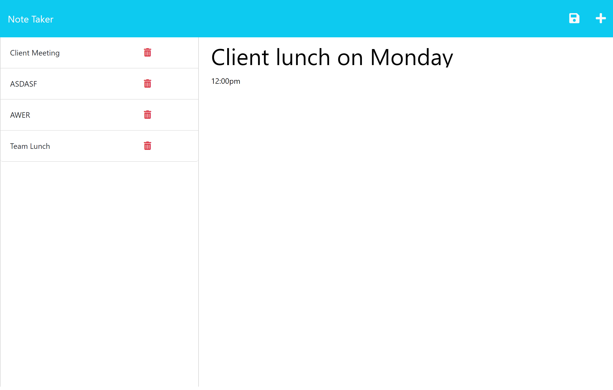

# Project Title: Note-Taker

## Project Description:
This application is known as a Note Taker. It can be used to write and save notes, using an Express.js backend framework. It saves and retrieves noted data from a JSON file. Starter code has a frontend application.

## Installation:
  This application runs through Node.js. It needs the `express.js` backend dipendencies that are installed using either `npm i` or `npm install` commands. `Heroku` was installed for deploying the application.

## Usage:
   The application can be invoked using a `node server.js` command.

   ### Deployed application URL from Heroku:

    https://intense-chamber-44315.herokuapp.com/ 
  
      
   The following screenshots depict the generated website. 

   

   

   

## License:

 

Read more about the MIT licence here: https://opensource.org/licenses/MIT.   

 ## Credits:
  Thanks to Xander Rapstine (https://github.com/Xandromus), John McCambridge (https://github.com/nol166) and George (https://github.com/Georgeyoo) for providing rescources for this project.

## Questions?
  ### Reach me here: 
   My GitHub profile:  [veerak21](https://github.com/veerak21),

   My E-mail: pv.kallu@gmail.com.  